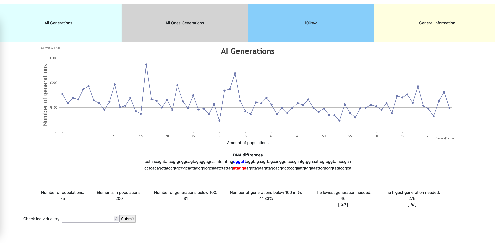
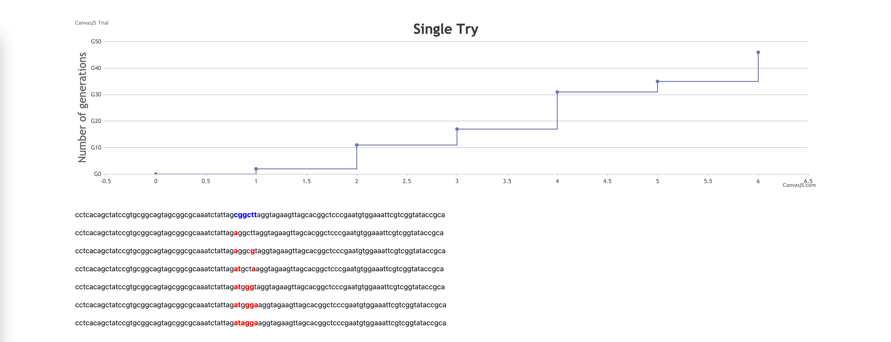

<h2>DNA checker</h2>
Python AI software to Check how many generations have to pass to change healthy DNA to the unhealthy one.

 As we know there are some disease wrote in our DNA, and looking into us in to our "binary" code we can say probabilty of occurrence some disease. Our algoritm will check, how many generation have to pass, to change health DNA to  We could use it for example in medicine, to check what is the probability that child made from those DNAs could get genetic disease.

<h3> Live demo</h3>
https://dnachecker.codeex.pl/

<h3> To run: </h3>
Run python(and generate json):

- docker run -it --rm --name my-running-script -v "$PWD":/usr/src/myapp -w /usr/src/myapp python:3 python runDNA.py

Run PHP server(display data in chart):
- docker run -d -p 8888:80 --name ProjektAI -v "$PWD":/var/www/html php:7.2-apache

Open browser:
- localhost:8888

Special Thanks to Mateusz M.:
- https://mmazurek.dev/algorytmy-genetyczne-w-pythonie/
Who gave me knowledge to do this

Also thank those:
- https://towardsdatascience.com/genetic-algorithm-implementation-in-python-5ab67bb124a6
- https://towardsdatascience.com/a-simple-genetic-algorithm-from-scratch-in-python-4e8c66ac3121
- https://pypi.org/project/geneticalgorithm/
- https://datascienceplus.com/genetic-algorithm-in-machine-learning-using-python/

  DNA generator: https://www.bioinformatics.org/sms2/random_dna.html
 

<h3>Presentation: </h3>
https://drive.google.com/file/d/1HCejWJUW_l3qycVk6kMsh7MH3Tc1cmnd/view?usp=sharing
<h3>Documentation: </h3>
https://drive.google.com/file/d/1pWwdhrgPb6vB_oQ7AlXVNCPcm3BRUtbt/view?usp=sharing
<h3>Some screenshots</h3>

 
 

 
 
